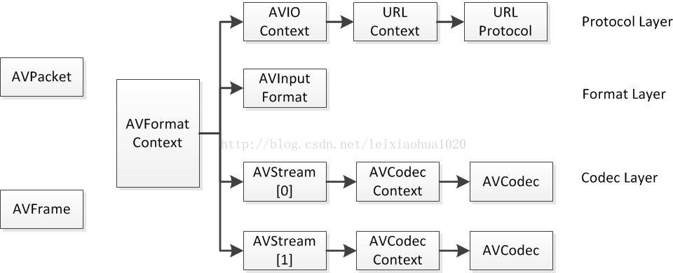

# FFmpeg structure

## FFmpeg关键结构体之间的关系

视频播放器播放视频文件，需要经过以下几个步骤：**解协议，解封装，解码视音频，视音频同步**。

如果播放本地文件则以下几个步骤：**解封装，解码视音频，视音频同步**。

FFMPEG中结构体很多。最关键的结构体可以分成以下几类：

* 解协议（http,rtsp,rtmp,mms）

AVIOContext，URLProtocol，URLContext主要存储视音频使用的协议的类型以及状态。URLProtocol存储输入视音频使用的封装格式。每种协议都对应一个URLProtocol结构。（注意：FFMPEG中文件也被当做一种协议“file”）

* 解封装（flv,avi,rmvb,mp4）

AVFormatContext主要存储视音频封装格式中包含的信息；AVInputFormat存储输入视音频使用的封装格式。每种视音频封装格式都对应一个AVInputFormat 结构。

* 解码（h264,mpeg2,aac,mp3）

每个AVStream存储一个视频/音频流的相关数据；每个AVStream对应一个AVCodecContext，存储该视频/音频流使用解码方式的相关数据；每个AVCodecContext中对应一个AVCodec，包含该视频/音频对应的解码器。每种解码器都对应一个AVCodec结构。

* 存数据

视频的话，每个结构一般是存一帧；音频可能有好几帧， 解码前数据：AVPacket，解码后数据：AVFrame

## 结构体

* AVFrame
* AVPacket
* AVFormatContext
* AVCodecContext
* AVIOContext
* AVCodec
* AVStream

> ### AVFrame

