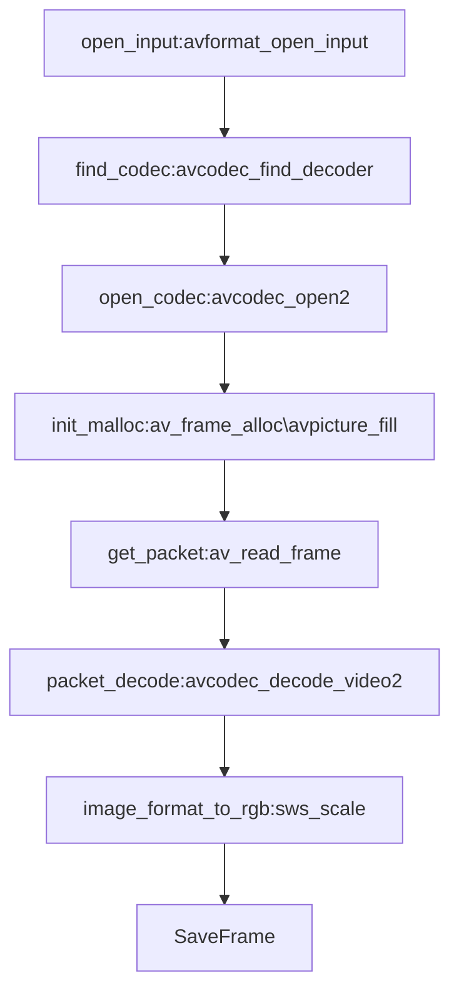

[TOC]

# ff_tutorial01

一个小示例程序，展示了如何使用libavformat和libavcodec从文件中读取视频并保存在本地。

 

## Code

```c
// tutorial01.c
//
// This tutorial was written by Stephen Dranger (dranger@gmail.com).
//
// Code based on a tutorial by Martin Bohme (boehme@inb.uni-luebeckREMOVETHIS.de)
// Tested on Gentoo, CVS version 5/01/07 compiled with GCC 4.1.1

// A small sample program that shows how to use libavformat and libavcodec to
// read video from a file.
//
// Use the Makefile to build all examples.
//
// Run using
//
// tutorial01 myvideofile.mpg
//
// to write the first five frames from "myvideofile.mpg" to disk in PPM
// format.

#include <libavcodec/avcodec.h>
#include <libavformat/avformat.h>
#include <libswscale/swscale.h>

#include <stdio.h>

void SaveFrame(AVFrame *pFrame, int width, int height, int iFrame) {
  FILE *pFile;
  char szFilename[32];
  int  y;
  
  // Open file
    printf("saving psth %s \n",szFilename);
  sprintf(szFilename, "frame%d.ppm", iFrame);
  pFile=fopen(szFilename, "wb");
  if(pFile==NULL)
    return;
  
  // Write header
  fprintf(pFile, "P6\n%d %d\n255\n", width, height);
  
  // Write pixel data
  for(y=0; y<height; y++)
    fwrite(pFrame->data[0]+y*pFrame->linesize[0], 1, width*3, pFile);
  
  // Close file
  fclose(pFile);
}

int main(int argc, char *argv[]) {
  AVFormatContext *pFormatCtx = NULL;
  int             i, videoStream;
  AVCodecContext  *pCodecCtx = NULL;
  AVCodec         *pCodec = NULL;
  AVFrame         *pFrame = NULL;
  AVFrame         *pFrameRGB = NULL;
  AVPacket        packet;
  int             frameFinished;
  int             numBytes;
  uint8_t         *buffer = NULL;

  AVDictionary    *optionsDict = NULL;
  struct SwsContext      *sws_ctx = NULL;
  
//  if(argc < 2) {
//    printf("Please provide a movie file\n");
//    return -1;
//  }
  // Register all formats and codecs
  // av_register_all();
  
  // Open video file
    char filepath[]= "/Users/suxiaohan/GitInterNet/FFmpeg_Leixiaohua/ret.mp4";
  if(avformat_open_input(&pFormatCtx, filepath, NULL, NULL)!=0)
    return -1; // Couldn't open file
  
  // Retrieve stream information
  if(avformat_find_stream_info(pFormatCtx, NULL)<0)
    return -1; // Couldn't find stream information
  
  // Dump information about file onto standard error
  av_dump_format(pFormatCtx, 0, argv[1], 0);
  
  // Find the first video stream
  videoStream=-1;
  for(i=0; i<pFormatCtx->nb_streams; i++)
    if(pFormatCtx->streams[i]->codec->codec_type==AVMEDIA_TYPE_VIDEO) {
      videoStream=i;
      break;
    }
  if(videoStream==-1)
    return -1; // Didn't find a video stream
  
  // Get a pointer to the codec context for the video stream
  pCodecCtx=pFormatCtx->streams[videoStream]->codec;
  
  // Find the decoder for the video stream
  pCodec=avcodec_find_decoder(pCodecCtx->codec_id);
  if(pCodec==NULL) {
    fprintf(stderr, "Unsupported codec!\n");
    return -1; // Codec not found
  }
  // Open codec
    printf("codec name %s \n",pCodec->name);
  if(avcodec_open2(pCodecCtx, pCodec, &optionsDict)<0)
    return -1; // Could not open codec
  
  // Allocate video frame
  pFrame=av_frame_alloc();
  
  // Allocate an AVFrame structure
  pFrameRGB=av_frame_alloc();
  if(pFrameRGB==NULL)
    return -1;
  
  // Determine required buffer size and allocate buffer
    numBytes=avpicture_get_size(AV_PIX_FMT_RGB24, pCodecCtx->width,
                  pCodecCtx->height);
  buffer=(uint8_t *)av_malloc(numBytes*sizeof(uint8_t));

  sws_ctx =
    sws_getContext
    (
        pCodecCtx->width,
        pCodecCtx->height,
        pCodecCtx->pix_fmt,
        pCodecCtx->width,
        pCodecCtx->height,
     AV_PIX_FMT_RGB24,
        SWS_BILINEAR,
        NULL,
        NULL,
        NULL
    );
  
  // Assign appropriate parts of buffer to image planes in pFrameRGB
  // Note that pFrameRGB is an AVFrame, but AVFrame is a superset
  // of AVPicture
    avpicture_fill((AVPicture *)pFrameRGB, buffer, AV_PIX_FMT_RGB24,
         pCodecCtx->width, pCodecCtx->height);
  
  // Read frames and save first five frames to disk
  i=0;
  while(av_read_frame(pFormatCtx, &packet)>=0) {
    // Is this a packet from the video stream?
    if(packet.stream_index==videoStream) {
      // Decode video frame
      avcodec_decode_video2(pCodecCtx, pFrame, &frameFinished,
               &packet);
      
      // Did we get a video frame?
      if(frameFinished) {
    // Convert the image from its native format to RGB
        sws_scale
        (
            sws_ctx,
            (uint8_t const * const *)pFrame->data,
            pFrame->linesize,
            0,
            pCodecCtx->height,
            pFrameRGB->data,
            pFrameRGB->linesize
        );
    
    // Save the frame to disk
    if(++i<=5)
      SaveFrame(pFrameRGB, pCodecCtx->width, pCodecCtx->height,
            i);
      }
    }
    
    // Free the packet that was allocated by av_read_frame
    av_free_packet(&packet);
  }
  
  // Free the RGB image
  av_free(buffer);
  av_free(pFrameRGB);
  
  // Free the YUV frame
  av_free(pFrame);
  
  // Close the codec
  avcodec_close(pCodecCtx);
  
  // Close the video file
  avformat_close_input(&pFormatCtx);
  
  return 0;
}

```


## Flow chart



## 关键函数

**SwsContext：**

利用ffmpeg进行图像数据格式的转换以及图片的缩放应用中，主要用到了swscale.h文件中的三个函数，分别是：

[](javascript:void(0);)

```c
  struct SwsContext *sws_getContext(int srcW, int srcH, enum AVPixelFormat srcFormat,
                               int dstW, int dstH, enum AVPixelFormat dstFormat,
                               int flags, SwsFilter *srcFilter,
                               SwsFilter *dstFilter, const double *param);
  int sws_scale(struct SwsContext *c, const uint8_t *const srcSlice[],
                     const int srcStride[], int srcSliceY, int srcSliceH,
                   uint8_t *const dst[], const int dstStride[]);
  void sws_freeContext(struct SwsContext *swsContext);
/*
sws_getContext函数可以看做是初始化函数，它的参数定义分别为：

      int srcW，int srcH 为原始图像数据的高和宽；

      int dstW，int dstH 为输出图像数据的高和宽；

      enum AVPixelFormat srcFormat 为输入和输出图片数据的类型；eg：AV_PIX_FMT_YUV420、PAV_PIX_FMT_RGB24；

      int flags 为scale算法种类；eg：SWS_BICUBIC、SWS_BICUBLIN、SWS_POINT、SWS_SINC；

      SwsFilter *srcFilter ，SwsFilter *dstFilter，const double *param 可以不用管，全为NULL即可；

  sws_scale函数则为执行函数，它的参数定义分别为：

      struct SwsContext *c 为sws_getContext函数返回的值；

      const uint8_t *const srcSlice[]，uint8_t *const dst[] 为输入输出图像数据各颜色通道的buffer指针数组；

      const int srcStride[]，const int dstStride[] 为输入输出图像数据各颜色通道每行存储的字节数数组；     

      int srcSliceY 为从输入图像数据的第多少列开始逐行扫描，通常设为0；

      int srcSliceH 为需要扫描多少行，通常为输入图像数据的高度；

  sws_freeContext函数为结束函数，它的参数即为sws_getContext函数返回的值；
*/
```

整个过程有点像我先定一个模子（大小颜色）：**sws_getContext**；

然后把沙子装进去，成了模子的形状：**sws_scale**

最后把模子销毁：**sws_freeContext**

**avpicture_fill函数：**

av_frame_alloc(void)函数用来分配一个AVFrame结构体。**这个函数只是分配AVFrame结构体，但data指向的内存并没有分配**，需要我们指定（这里是buffer），这个内存的大小就是一张特定格式图像所需的大小。

通过av_image_fill_arrays把av_malloc得到的内存和AVFrame关联起来

avpicture_fill函数将ptr指向的数据填充到picture内，但并没有拷贝，只是将picture结构内的data指针指向了ptr的数据。其实现如下：

```c
// libavcodec/avpicture.c
int avpicture_fill(AVPicture *picture, const uint8_t *ptr,
                   enum AVPixelFormat pix_fmt, int width, int height)
{
    return av_image_fill_arrays(picture->data, picture->linesize,
                                ptr, pix_fmt, width, height, 1);
}

avpicture_fill(
  						(AVPicture *)pFrameRGB, //AVPicture结构体的成员就是AVFrame结构体的强两个成员，这样在一些函数中就可以直接通过AVPicture结构体指针去访问AVFrame结构体变量。可以进行类型转换。
               buffer,
  						AV_PIX_FMT_RGB24,
               pCodecCtx->width, 
               pCodecCtx->height
);
```


## 参考链接

[FFmpeg avpicture_fill](https://www.cnblogs.com/my_life/articles/6932568.html)


