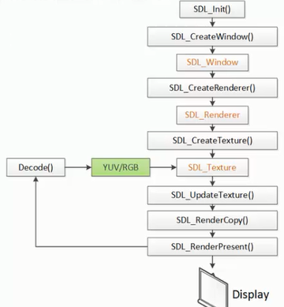

# ff_tutorial02

使用ffmpeg+SDL2制作的一个简易的视频播放器

## code

```c
int thread_exit=0;
int thread_pause=0;
int sfp_refresh_thread(void *opaque){
    thread_exit=0;
    thread_pause=0;

    while (!thread_exit) {
        if(!thread_pause){
            SDL_Event event;
            event.type = SFM_REFRESH_EVENT;
            SDL_PushEvent(&event);
        }
        SDL_Delay(40);
    }
    thread_exit=0;
    thread_pause=0;
    //Break
    SDL_Event event;
    event.type = SFM_BREAK_EVENT;
    SDL_PushEvent(&event);

    return 0;
}
int main(int argc, char *argv[])
{

    AVFormatContext *pFormatctx = NULL;
    AVCodecContext *codecctx = NULL;
    AVCodec *codec = NULL;
    AVPacket *packet ;
    AVFrame *frame = NULL;
    AVFrame *frameyuv = NULL;
    AVDictionary    *optionsDict = NULL;
    struct SwsContext *img_convert_ctx;

    unsigned char   *buffer;//包，从流中读出的一段数据
    int ret = 0;
    int videoIndex = -1;
    
    SDL_Window *screen;
    SDL_Renderer* sdlRenderer;
    SDL_Texture* sdlTexture;
    SDL_Rect sdlRect;
    SDL_Event event;
    
    ret = avformat_open_input(&pFormatctx, "/Users/suxiaohan/GitInterNet/FFmpeg_Leixiaohua/ret.mp4", NULL, NULL);
    if (ret != 0 ) {
        printf("open file fail\n");
        return  -1;
    }
    if (avformat_find_stream_info(pFormatctx, NULL)<0){
        printf("can not find stream info\n");
        return -1;
        
    }
    
    for (int i=0; i< pFormatctx->nb_streams; i++) {
        if(pFormatctx->streams[i]->codecpar->codec_type == AVMEDIA_TYPE_VIDEO){
            videoIndex = i;
            break;
        }
    }
    if (videoIndex == -1) {
        printf("can not find any videostream\n");
    }
    codecctx = pFormatctx->streams[videoIndex]->codec;
    if (codecctx == NULL) {
        printf("can not find the codec");
        return -1;
    }
    codec = avcodec_find_decoder(codecctx->codec_id);
    if(avcodec_open2(codecctx, codec, &optionsDict)<0){
        printf("open codec fail \n");
        return -1;
    };
    frame = av_frame_alloc();
    frameyuv =av_frame_alloc();
    packet=(AVPacket *)av_malloc(sizeof(AVPacket));
    // Determine required buffer size and allocate buffer
    int outBufferSize;
    outBufferSize =
       avpicture_get_size(AV_PIX_FMT_YUV420P, codecctx->width, codecctx->height);
    buffer = (unsigned char *)av_malloc(outBufferSize);
    avpicture_fill((AVPicture *)frameyuv, buffer,
        AV_PIX_FMT_YUV420P, codecctx->width, codecctx->height);

    img_convert_ctx = sws_getContext(codecctx->width, codecctx->height, codecctx->pix_fmt, codecctx->width, codecctx->height, AV_PIX_FMT_YUV420P, SWS_BICUBIC, NULL, NULL, NULL);
    
    // sdl part
    if(SDL_Init(SDL_INIT_VIDEO | SDL_INIT_AUDIO | SDL_INIT_TIMER)) {
        printf( "Could not initialize SDL - %s\n", SDL_GetError());
        return -1;
    }
    int screen_w = codecctx->width;
    int screen_h = codecctx->height;
    
    screen = SDL_CreateWindow("Simplest ffmpeg player's Window", SDL_WINDOWPOS_UNDEFINED, SDL_WINDOWPOS_UNDEFINED,
                              screen_w , screen_h ,SDL_WINDOW_OPENGL);
    if (!screen) {
        printf("create window fail \n");
        return -1;
    }
    sdlRenderer = SDL_CreateRenderer(screen, -1, 0);
    sdlTexture = SDL_CreateTexture(sdlRenderer, SDL_PIXELFORMAT_IYUV, SDL_TEXTUREACCESS_STREAMING,codecctx->width,codecctx->height);
    sdlRect.x=0;
    sdlRect.y=0;
    sdlRect.w=screen_w;
    sdlRect.h=screen_h;
    int video_tid =0;
    video_tid = SDL_CreateThread(sfp_refresh_thread,NULL,NULL);

    int gotpic = 1;
    for (;;) {
        printf("dd");
        SDL_WaitEvent(&event);
        if (event.type==SFM_REFRESH_EVENT) {
            printf("here\n");
                while (1) {
                    if(av_read_frame(pFormatctx, packet)<0){
                        thread_exit=1;
                    }
                    if(packet->stream_index==videoIndex){
                        printf("test %d \n",packet->size);
                        break;
                    }
                }
               if( avcodec_decode_video2(codecctx, frame, &gotpic, packet)<0){
                    printf("Decode Error.\n");
                    break;
                };
                if (gotpic) {
                    sws_scale(img_convert_ctx, (const unsigned char* const*)frame->data, frame->linesize, 0, codecctx->height, frameyuv->data, frameyuv->linesize);

                    SDL_UpdateTexture( sdlTexture, NULL, frameyuv->data[0], frameyuv->linesize[0] );
                    SDL_RenderClear( sdlRenderer );
                    SDL_RenderCopy( sdlRenderer, sdlTexture, NULL, &sdlRect);
                    SDL_RenderPresent( sdlRenderer );

                }
                av_packet_unref(packet);
        }
    }

    sws_freeContext(img_convert_ctx);
    SDL_Quit();
    //--------------
    av_frame_free(&frame);
    av_frame_free(&frameyuv);
    avcodec_close(codecctx);
    avformat_close_input(&pFormatctx);
    printf("done !\n");
    return 0;
    
    
}

```


## 关键点

> SDL2

使用SDL播放一个视频代码流程大体如下

**初始化:** 

> SDL_Init(): 初始化SDL。 
> SDL_CreateWindow(): 创建窗口（Window）。 
> SDL_CreateRenderer(): 基于窗口创建渲染器（Render）。 
> SDL_CreateTexture(): 创建纹理（Texture）。 

**循环渲染数据:** 

> SDL_UpdateTexture(): 设置纹理的数据。 
> SDL_RenderCopy(): 纹理复制给渲染器。 
> SDL_RenderPresent(): 显示。


**SDL线程处理**

>SDL_CreateThread():SDL线程创建。



